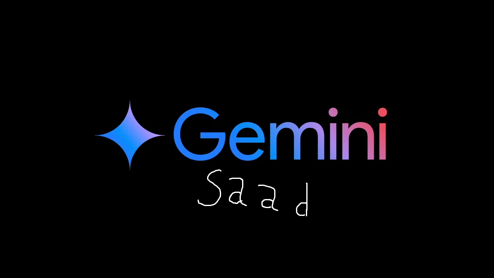

# Gemini Saad
Basic Google Gemini Model edited by : Saad Almalki with no features 😥


## Import Libraries

`pip install nltk chatterbot` 
`pip install chatterbot_corpus`

## Create a Python script
filename.py

## Add code in Python file

```python

import google.generativeai as ai
import google.generativeai.gemini as gemini
import random as rm
from chatterbot import ChatBot
from chatterbot.trainers import ChatterBotCorpusTrainer

# Find your API key at console.cloud.google.com/apis/credentials
API_KEY = 'API_KEY'

# Configure the AI model
ai.configure(api_key=API_KEY)

# Create a new AI model
model = gemini.Model()
chat = model.start_chat()

# Start a conversation
while True:
    user_input = input('You: ')
    response = chat.send(user_input)
    print('Gemini: ' + response)
    if user_input == 'exit':
        break
    response = chat.send(user_input)
    print('Gemini: ' + response)


# Made by : Saad Almalki
# this model not made it by me from zero , just forked from google gemini .
# Copyright by : Google
```

## Get your Gemini API
Just Google it my bro .
